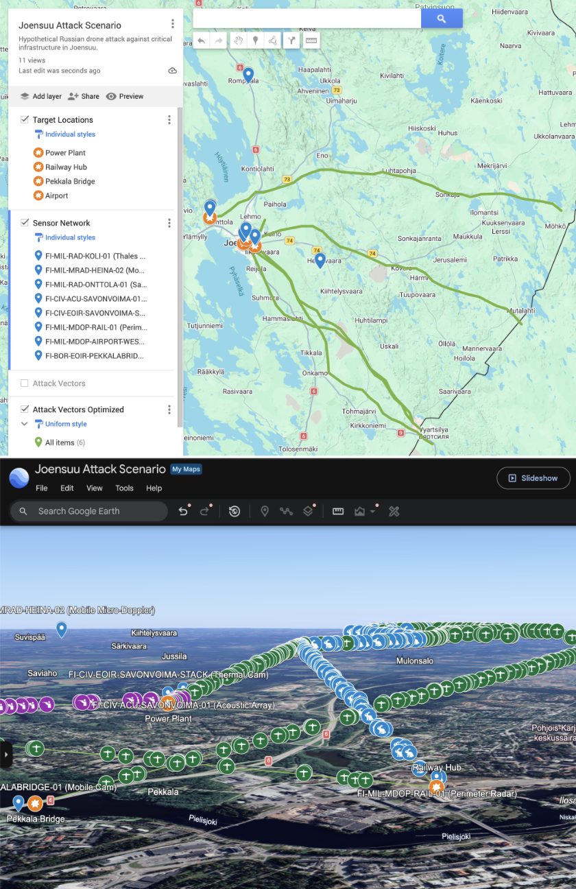

# SAPIENT Synthetic Data Generator (SDG)


The SAPIENT Synthetic Data Generator (SDG) is a configurable, data-driven simulation framework for generating realistic multi-sensor surveillance and tracking data across arbitrary operational scenarios.

By combining user-defined environments, simulated entities, and advanced sensor error models, SDG produces synthetic, SAPIENT-compatible sensor streams that emulate how real-world surveillance systems detect, track, classify, and report activity.

High-quality multi-sensor datasets are often difficult to obtain due to cost, operational constraints, limited availability, or sensitivity of real-world deployments. SDG addresses this challenge by enabling rapid generation of realistic synthetic datasets without dependence on specific geographic locations, sensor hardware, or live operational data.

The generated data can be used to develop, test, and validate:

- Command-and-control (C2) systems
- Sensor fusion pipelines
- Autonomous systems
- Situational awareness applications
- Machine learning and AI models

SDG enables repeatable simulation, scalable experimentation, and accelerated development of SAPIENT-based surveillance and autonomy solutions.
<br clear="right"/>

## Key Features

* **Single-Source Configuration**
Define entire complex scenarios—including geography, assets, and sensor layouts—within a single, human-readable `.json` file.
* **Terrain-Aware Simulation**
Ingests real-world Digital Elevation Models (DEM) via OpenTopography to ensure entity paths and line-of-sight calculations adapt realistically to local geography.
* **High-Fidelity Kinematics**
Propagates entity movement using physics-backed behavioral profiles, establishing a mathematically precise absolute "Ground Truth."
* **Realistic Sensor Degradation**
Emulates true-to-life surveillance limitations by actively injecting measurement noise, tracking errors, and horizon/visibility constraints.
* **Native SAPIENT Compliance**
Outputs an asynchronous, real-time data stream fully formatted to the SAPIENT message protocol for seamless integration with downstream command and control systems.

## Getting Started

Follow these instructions to configure, run, and export your sensor simulation scenario.

### Prerequisites

Ensure your host machine has Python 3.10+ installed. Clone this repository and install the required dependencies:

### Clone the repository
```bash
git clone https://github.com/DEFINE-AI-Foundry/scenario-foundry.git
cd scenario-foundry
```

### Install Python requirements and the project
```bash
pip install -e .
```
The runtime dependencies are declared in `pyproject.toml` and are installed along with the project.

### Install an API key from opentopography.org

- Register a new account to OpenTopography (or login if you have an account)
- Within your account, generate an API key
- Create a `.env`file to `scenario-generator`root
- Add the API key to the `.env`file as `OPENTOPOGRAPHY_API_KEY`

**Note:** Using OpenTopography is the key for a high fidelity data generation. However, if you have defined the terrain anchors, the data generation will use them as a fallback if the terrain files would be missing.

### Do a test run
```bash
python -m src.scenario_foundry.generate_scenario --scenario joensuu
```
This accumulates:
- tactical_vectors
- output_messages

### Repository Directory Structure

The workspace is organized into modular directories following standard development patterns:
```text
scenario-foundry/
├─ config/
│  ├─ scenarios/
│  │  ├─ alakurtti.json
│  │  ├─ joensuu.json
│  │  └─ scenario_guide.md
│  └─ schemas/
│     ├─ taxonomies/
│     │  └─ sapient_core_v2_0.json
│     └─ scenario.schema.json
├─ data/
│  ├─ export_output/
│  │  └─ joensuu/
│  ├─ generated_output/
│  ├─ tactical_scenarios/
│  └─ terrain/
├─ docs/
│  └─ images/
│     └─ joensuu_scenario.png
├─ protos/
│  └─ sapient_msg/
│     ├─ bsi_flex_335_v2_0/
│     └─ proto_options.proto
├─ src/
│  ├─ sapient_msg/
│  │  ├─ bsi_flex_335_v2_0/
│  │  └─ proto_options_pb2.py
│  ├─ scenario_foundry/
│  │  ├─ generation/
│  │  │  ├─ fetch_terrain.py
│  │  │  ├─ generate_sensor_data.py
│  │  │  └─ optimize_vectors.py
│  │  ├─ sapient/
│  │  │  └─ builder.py
│  │  ├─ validation/
│  │  │  └─ validate.py
│  │  ├─ config.py
│  │  ├─ export_scenario.py
│  │  └─ generate_scenario.py
│  └─ scenario_foundry.egg-info/
├─ tests/
├─ LICENSE
├─ pyproject.toml
└─ README.md
```

## Execution Pipeline (Step-by-Step)

The synthetic data generation workflow consists of two simple steps and optional export:
```text
  [ Scenario Config ] ---> ( Run Simulation ) ---> [ SAPIENT Messages ] ---> ( Export Layers ) ---> [ GIS Maps ]
```

### Step 1: Scenario Configuration Setup

Create or modify a manually planned attack scenario (e.g., `config/scenarios/joensuu.json` or `config/scenarios/alakurtti.json`).

Inside the file, define:
- targets
- baseline vectors
- sensor positions
- terrain anchor elevations 

Each threat profile carries a `classification`: an ordered path through the BSI Flex 335 SAPIENT core taxonomy, such as `["Air vehicle", "UAV fixed wing", "Military"]`. The permitted level names live in `config/schemas/taxonomies/sapient_core_v2_0.json`, and shorter paths like `["Air vehicle"]` are valid where the class is only partially resolved.

You can find detailed instructions in `config/scenarios/scenario_guide.md`

### Step 2: Execute the Generation Engine

Run the main generator to parse your scenario configuration, refine flight vectors using terrain elevations, emulate target detections, and generate SAPIENT-compliant real-time outputs:
```bash
# Runs the simulation using input config, fetches terrain, and dumps tactical and message streams
python -m src.scenario_foundry.generate_scenario --scenario joensuu
```

Outputs Generated:

`joensuu_tactical.json`: The scenario refined against terrain elevation, holding the flight vectors the simulation actually flies.

`joensuu_messages.json`: A chronological database of simulated sensor detection reports formatted in compliance with SAPIENT message standards.

#### Validation

Before anything is generated, the generator validates the scenario against `config/schemas/scenario.schema.json` and the SAPIENT taxonomy. An invalid scenario stops the run with a message naming the offending profile and a non-zero exit status, so nothing downstream ever sees a malformed configuration.

To check a scenario on its own, without generating anything:
```bash
python -m src.scenario_foundry.validation.validate --location joensuu
```

#### Reproducibility

Pass an integer `--seed` to make a run fully reproducible — identical input plus identical seed always produces identical output:
```bash
# Reproducible run: identical output every time for a given seed
python -m src.scenario_foundry.generate_scenario --scenario joensuu --seed 42
```

The flag is accepted by `generate_scenario`, `generate_sensor_data`, and `optimize_vectors`. Omitting it preserves the default non-deterministic behavior.

### Step 3: Run the GIS Layer Exporter (optional)

Transform tactical data and sensor message outputs into map-ready CSV files:
```bash
python -m src.scenario_foundry.export_scenario \
  --scenario joensuu_tactical.json \
  --messages joensuu_messages.json \
  --outdir data/export_output/ \
  --sample-rate 10
```
`--scenario` and `--messages` are looked up inside `data/tactical_scenarios/` and `data/generated_output/` respectively, unless you pass an absolute path.

OR
```bash
python -m src.scenario_foundry.export_scenario --location joensuu
```

The layers are written to a per-scenario subdirectory of `--outdir` — `data/export_output/joensuu/` for the commands above — so exporting several scenarios never overwrites earlier results. The subdirectory is named after `--location`, or after the tactical file name when only `--scenario` is given.

## Geospatial Layer Visualization

Once exported, you can visualize your tactical layers on Google My Maps or standard GIS tools (QGIS, ArcGIS):

- Open Google My Maps and create a new custom map.

- For each generated CSV layer inside `data/export_output/<scenario>/`, click Add Layer and select Import:

| Layer Source CSV | Spatial Column Selection | Label / Title Column | Visual Styling Tips |
| :--- | :--- | :--- | :--- |
| `targets_layer.csv` | Latitude, Longitude | `Target_Name` | Red Flags for critical structures. |
| `flight_vectors_layer.csv` | WKT (Well-Known Text) | `Vector_ID` | Group styles by classification (solid lines). |
| `sensor_network_layer.csv` | Latitude, Longitude | `Sensor_Node_ID` | Blue Radar/Shield icons showing sensor nodes. |
| `sensor_detections_layer.csv` | Latitude, Longitude | `Track_ID` | Small point clusters grouped by Tracking State. |

## Development

Install the project together with the development tooling (Ruff, pytest, pytest-cov):

```bash
pip install -e ".[dev]"
```

### Linting

Linting and formatting use [Ruff](https://docs.astral.sh/ruff/). Its configuration lives in `pyproject.toml`:

```bash
ruff check .           # report lint issues
ruff format --check .  # report formatting issues

ruff check --fix .     # auto-fix lint issues
ruff format .          # apply formatting
```

### Testing

Tests use `pytest` with branch coverage via `pytest-cov`. The coverage settings and the 95% minimum gate are configured in `pyproject.toml`, so a plain invocation runs the full suite and prints a coverage report:

```bash
pytest
```

The run fails if coverage drops below the configured threshold.

### Continuous Integration

All of the above run automatically on GitHub Actions (`.github/workflows/ci.yml`) for every push to `main`/`master` and every pull request: Ruff lint, Ruff format check, and the test suite with the coverage gate.